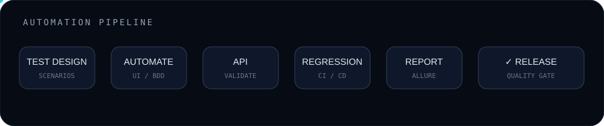
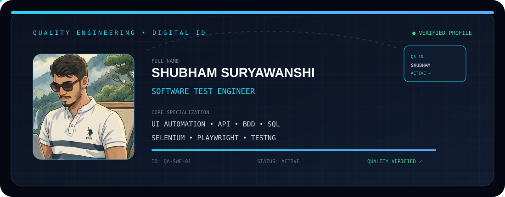

<div align="center">


### 🧪 SOFTWARE TEST ENGINEER · QA AUTOMATION · MANUAL

**Finding defects early. Automating the repeatable. Protecting product quality.**

[](https://www.java.com/)
[](https://developer.mozilla.org/en-US/docs/Web/JavaScript)
[](https://www.selenium.dev/)
[](https://playwright.dev/)
[](https://cucumber.io/)
[](https://www.postman.com/)

</div>

---

## 👋 About Me

I'm a Software Test Engineer focused on **manual testing, UI automation, API testing, BDD, database validation and quality engineering**.

My approach is simple:

> **Understand the requirement → design the right tests → automate what matters → investigate failures → ship with confidence.**

### 🔍 What I work with

- **UI Automation:** Selenium WebDriver, Playwright
- **Languages:** Java, JavaScript
- **Frameworks:** TestNG, Cucumber BDD
- **API:** Postman, REST API validation
- **Database:** SQL
- **Build / VCS:** Maven, Git
- **Reporting:** Allure
- **Testing:** Functional, Smoke, Regression, Integration, E2E

---

## ⚙️ QA ENGINEERING PIPELINE



---

## 🪪 QA ENGINEER ID CARD

The animated ID card uses the profile image supplied for this portfolio.




---

## 🚀 Featured QA Work

### 🏦 FinCore — Loan Origination Quality Engineering

A complete QA portfolio covering the software testing lifecycle:

**Requirements → Test Scenarios → Test Cases → Test Data → API → SQL → Defects → RTM → Execution → Reports**

[View FinCore QA Project →](https://github.com/Shubham-QA-Web/fincore-loan-origination-qa)

---

### 🧪 MittArv Automation

Java-based automation work using Maven/TestNG with execution evidence and Allure reporting.

[View MittArv Automation →](https://github.com/Shubham-QA-Web/MittArv)

---

### 🌐 DealsDray Web Automation

Web automation assessment demonstrating Java/Selenium automation, validation and execution evidence.

[View DealsDray Automation →](https://github.com/Shubham-QA-Web/DealsDray-Automation-Assessment)

---

## 🧰 Testing Capability

| Capability | Focus |
|---|---|
| Functional Testing | Requirements, positive/negative scenarios, validations |
| Regression Testing | Reusable suites and critical workflows |
| UI Automation | Selenium WebDriver, Playwright |
| API Testing | REST requests, status codes, assertions |
| BDD | Cucumber / Gherkin |
| Database Testing | SQL queries and data validation |
| Defect Management | Severity, priority, reproduction and RCA |
| Test Reporting | Execution evidence and Allure reports |
| Agile QA | Requirement analysis, sprint testing and collaboration |

---

## 🧠 My QA Mindset

```text
Requirement
    │
    ▼
Understand the risk
    │
    ▼
Design meaningful tests
    │
    ├───────────────┐
    ▼               ▼
Manual validation   Automation
    │               │
    └───────┬───────┘
            ▼
       API + SQL
            │
            ▼
      Regression
            │
            ▼
      Report defects
            │
            ▼
       Verify fixes
            │
            ▼
       Quality Gate
            │
            ▼
        ✓ RELEASE
```

---

## 📊 GitHub Activity

<div align="center">


</div>
---

<div align="center">

### 🐞 FIND IT · AUTOMATE IT · VERIFY IT · SHIP IT

**Quality is not a phase. Quality is a continuous engineering practice.**

</div>
