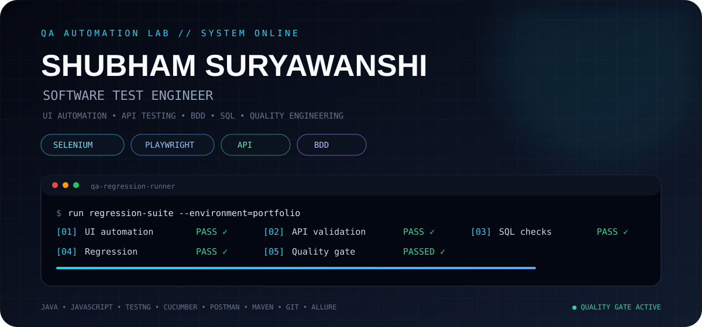

  

# 
<h2 align="center">🧪 QA TESTING ARSENAL</h2>

  <i>Tools and technologies I use to test, automate, debug, and verify software.</i>

<table align="center">
  <tr>
    <td width="50%" valign="top">

### 🤖 UI AUTOMATION

- **Playwright**
- **Selenium WebDriver**
- **TestNG**
- **Cucumber / BDD**

    </td>
    <td width="50%" valign="top">

### 💻 PROGRAMMING

- **Java**
- **JavaScript**
- **Java 8 / Collections**
- **Stream API**

    </td>
  </tr>

  <tr>
    <td width="50%" valign="top">

### 🔌 API & DATABASE

- **Postman**
- **REST API Testing**
- **SQL**
- **API Validation**

    </td>
    <td width="50%" valign="top">

### 🛠️ ENGINEERING TOOLS

- **Git**
- **GitHub**
- **Maven**
- **Jira**
- **Allure Reports**

    </td>
  </tr>
</table>

👋 Hi, I'm Shubham Suryawanshi

## 🧪 Software Test Engineer

> I don't just verify that software works — I investigate how it can fail.

### 🔧 QA & Testing

🧪 Manual Testing  
🤖 Selenium + Java  
🎭 Playwright  
🔌 API Testing — Postman  
🗄️ SQL / Database Testing  
🐞 JIRA / Defect Management  
🔄 Regression & End-to-End Testing

### 🚀 Currently Learning

- Advanced Playwright
- API Automation
- Performance Testing
- CI/CD
- Advanced SQL
- Modern Frontend Testing
